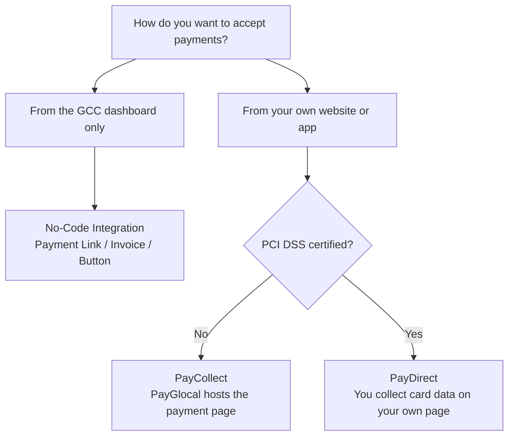

PayGlocal supports three ways to accept payments. The right one depends on how you want to collect money — and, if it's on your own site, who handles the card details.

<CardGroup cols={3}>
  <Card title="No-Code" icon="sparkles" color="#10B981" href="/no-code/overview">
    **Collect without writing code.** Create Payment Links, Invoice Links, and Payment Buttons from the GCC dashboard. PayGlocal hosts the checkout.
  </Card>
  <Card title="PayCollect" icon="window" color="#1A6FE8" href="/merchant/paycollect/overview">
    **API — PayGlocal-hosted checkout.** Your backend sends a request; PayGlocal collects the card details on a secure hosted page. No PCI DSS certification needed.
  </Card>
  <Card title="PayDirect" icon="code" color="#8B5CF6" href="/merchant/paydirect/overview">
    **API — your own checkout.** You collect card details in your own UI and send them to PayGlocal. Requires PCI DSS certification.
  </Card>
</CardGroup>

<Note>
  **PayCollect** and **PayDirect** are the two modes of API integration. See the [API Integration overview](/integration/api-overview) to compare them in detail.
</Note>

---

## Still Deciding?

Follow the path that matches how you want to accept payments:

<Note>
  No-Code and API integration aren't mutually exclusive. Many merchants use Payment Links for quick ad-hoc collections while their checkout runs on PayCollect or PayDirect.
</Note>

---

## Next Steps

<CardGroup cols={2}>
  <Card title="No-Code Integration" icon="sparkles" href="/no-code/overview">
    Payment Link, Invoice Link, and Payment Button — all dashboard-driven.
  </Card>
  <Card title="API Integration" icon="code" href="/integration/api-overview">
    Compare PayCollect and PayDirect, then build payments into your own product.
  </Card>
</CardGroup>

---

Questions? Contact [merchant.support@payglocal.in](mailto:merchant.support@payglocal.in).
