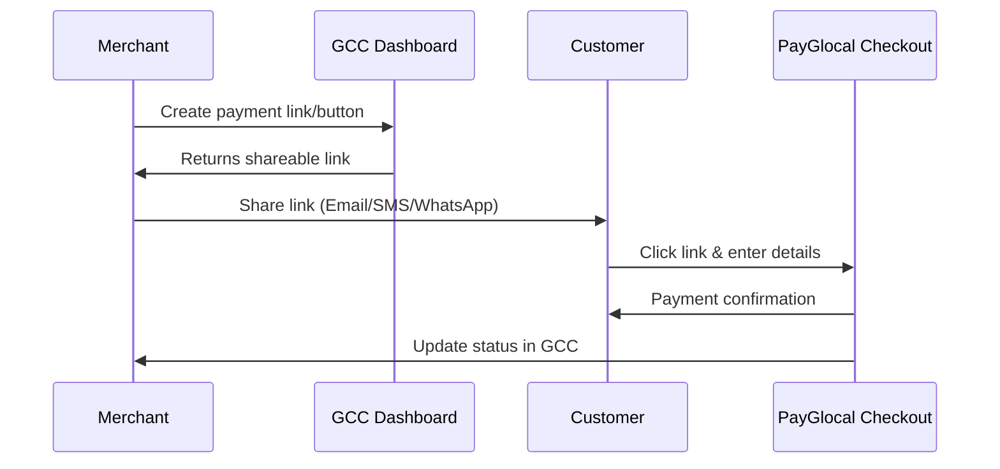

## What is No-Code Integration?

No-code integration allows you to start accepting payments through PayGlocal **without any API integration or technical development**. All configuration is done through the **GCC (Glocal Command Center) dashboard**, and PayGlocal handles the entire payment experience.

These solutions are ideal for:
- Businesses that need to start accepting payments quickly
- Teams without dedicated development resources
- Use cases requiring simple, one-time, or ad-hoc payments
- Sharing payment requests via email, SMS, or WhatsApp

## Available No-Code Solutions

<CardGroup cols={3}>
  <Card 
    title="Payment Link" 
    icon="link" 
    href="/no-code/payment-link"
  >
    Share a payment URL with customers via email, SMS, or any channel
  </Card>
  
  <Card 
    title="Invoice Link" 
    icon="file-invoice" 
    href="/no-code/invoice-link"
  >
    Send invoice-style payment requests with detailed billing information
  </Card>
  
  <Card 
    title="Payment Button" 
    icon="circle-play" 
    href="/no-code/payment-button"
  >
    Embed a payment button on your website without API integration
  </Card>
</CardGroup>

## How No-Code Integration Works

<Steps>
  <Step title="Access GCC Dashboard">
    Log in to the [GCC dashboard](https://merchant.payglocal.in) with your credentials.
  </Step>
  
  <Step title="Choose Your Product">
    Select the no-code product that fits your use case (Payment Link, Invoice Link, or Payment Button).
  </Step>
  
  <Step title="Configure Payment Details">
    Enter the payment amount, currency, customer information, and other required details through the dashboard interface.
  </Step>
  
  <Step title="Generate & Share">
    The system generates a payment link or Invoice Link. Share it with your customer via email, SMS, WhatsApp and Payment Button embed it on your website and Start accepting Payments.
  </Step>
  
  <Step title="Customer Pays">
    Your customer completes payment on PayGlocal's secure hosted checkout page.
  </Step>
  
  <Step title="Track & Reconcile">
    Monitor payment status and reconcile transactions directly in the GCC dashboard.
  </Step>
</Steps>

## Key Benefits

| Benefit | Description |
|---------|-------------|
| **No Development Required** | Create and share payment requests through a simple web interface |
| **Quick Setup** | Start accepting payments in minutes, not weeks |
| **Secure & PCI Compliant** | PayGlocal handles all payment security and compliance |
| **Multiple Channels** | Share links via email, SMS, WhatsApp, or social media |
| **Real-time Tracking** | Monitor all payment statuses from the GCC dashboard |
| **Customer Notifications** | Automatic email and SMS notifications to customers |

## Payment Flow

## Comparison: Which Product to Use?

| Use Case | Recommended Product |
|----------|---------------------|
| Share a one-time payment request | **Payment Link** |
| Send formal billing/invoice requests | **Invoice Link** |
| Add payment to your website without coding | **Payment Button** |
| Request payment after service delivery | **Payment Link** or **Invoice Link** |

## Next Steps

<CardGroup cols={3}>
  <Card 
    title="Create a Payment Link" 
    icon="link" 
    href="/no-code/payment-link"
  >
    Learn how to generate and share payment links
  </Card>
  
  <Card 
    title="Invoice Link Setup" 
    icon="file-invoice" 
    href="/no-code/invoice-link"
  >
    Send professional invoice payment requests
  </Card>
  
  <Card 
    title="Payment Button" 
    icon="circle-play" 
    href="/no-code/payment-button"
  >
    Embed payment buttons on your website
  </Card>
</CardGroup>

## Support

- **Product selection and business queries**: Contact your PayGlocal account manager
- **Technical issues**: Email [merchant.support@payglocal.in](mailto:merchant.support@payglocal.in)
